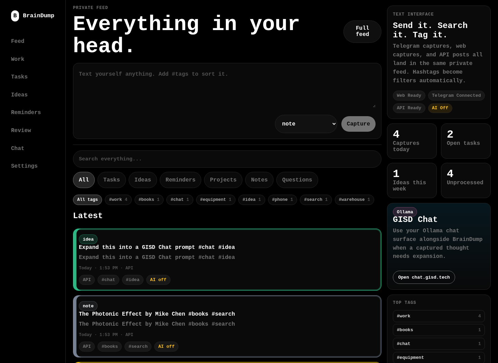
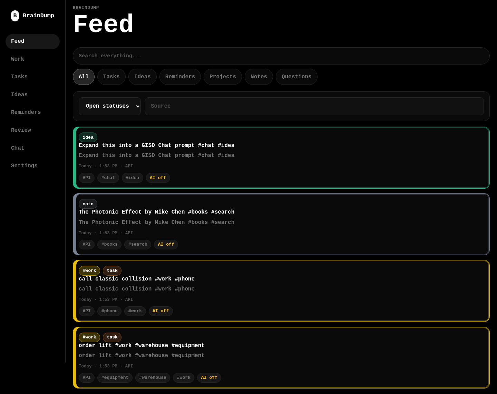
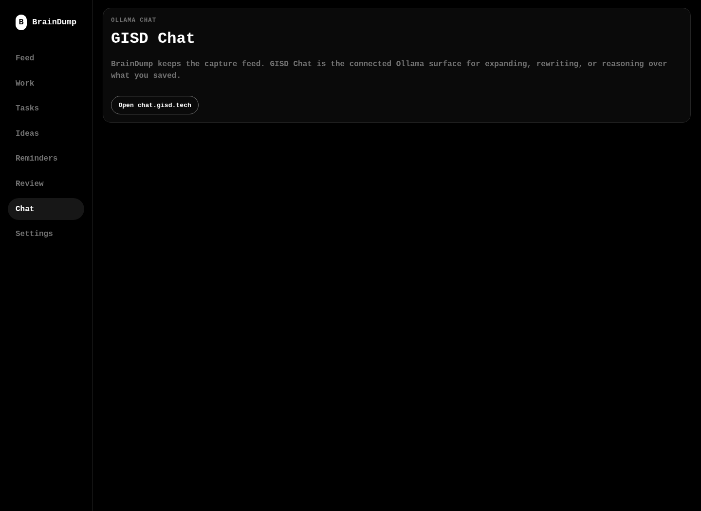

# BrainDump

BrainDump is a private, single-user capture inbox for thoughts, tasks, reminders, ideas, questions, and project fragments. Capture is always saved first. Optional AI processing can run later to suggest a title, summary, type, category, tags, priority, due date, and action items.

The MVP is built for Cloudflare Workers, D1, and optional Queues. Telegram is the first SMS-like capture channel because it is free to run, fast to set up, and does not require Twilio or paid SMS infrastructure.

## Stack

- Cloudflare Worker API in `src/worker.ts`
- React/Vite frontend in `src/main.tsx`
- Cloudflare D1 database
- Optional Cloudflare Queue for background AI processing
- Optional AI providers: `none`, `ollama`, `workers_ai`

Default `AI_PROVIDER` is `none`.

Current Worker URL: `https://braindump.boxospam.workers.dev`.

## How to Use BrainDump

BrainDump is built around fast capture. Send the thought first, then use commands and hashtags only when you already know where something belongs.

### From Telegram

Open Telegram, message your BrainDump bot, and send a normal message:

```text
order lift
```

That saves as a `note` by default. BrainDump does not currently guess that this belongs to work unless AI processing is enabled and configured later. For predictable filing, use a command or hashtags.

Use a command at the start of the message to set the capture type:

```text
/task order lift
/idea local property photo service
/remind call vendor Monday
/project warehouse move plan
/question what did we decide about labels?
/note check quote details
```

Use `/work` when the item belongs in the work grouping:

```text
/work order lift
```

`/work` saves the capture as a `task` and sets the category to `work`.

Use hashtags to file one message in one or more tag groups:

```text
/task order lift #work #warehouse #equipment
```

This saves one task, then files it under `#work`, `#warehouse`, and `#equipment`. Multiple hashtags are supported. Hashtags are explicit; BrainDump will not add `#work` just because the message says "work" unless you type `#work` or use `/work`.

Use `/search` to search from Telegram:

```text
/search lift
```

`/search` is a command, not a saved note. It replies with matching captures and does not create a new capture.

### Quick Examples

```text
random thought
```

Saved as a `note`.

```text
/task call classic collision #work #phone
```

Saved as a `task` and filed under `#work` and `#phone`.

```text
/work order lift #warehouse
```

Saved as a work `task` and filed under `#work` and `#warehouse`.

```text
/search classic collision
```

Searches your captures from Telegram.

### Web App

Use the web app when you want to scan, search, and clean up captures:

- The dashboard shows the latest captures first.
- The search box searches capture text, titles, summaries, and categories.
- The tag rail filters captures by hashtag or category.
- The work page shows work captures.
- GISD Chat at `https://chat.gisd.tech` is linked from BrainDump for expanding or reasoning over a captured thought.

### Screenshots

Dashboard:



Feed:



GISD Chat link:



## Setup

Install dependencies:

```bash
npm install
```

Edit `wrangler.toml`. A matching `wrangler.toml.example` is included for reference.

Create a D1 database:

```bash
npx wrangler d1 create braindump
```

Copy the returned `database_id` into `wrangler.toml`.

Run migrations locally:

```bash
npx wrangler d1 migrations apply braindump --local
```

Run migrations in Cloudflare:

```bash
npx wrangler d1 migrations apply braindump --remote
```

Add required secrets:

```bash
npx wrangler secret put APP_PASSWORD
npx wrangler secret put APP_BASE_URL
npx wrangler secret put CAPTURE_API_TOKEN
npx wrangler secret put TELEGRAM_BOT_TOKEN
npx wrangler secret put TELEGRAM_WEBHOOK_SECRET
npx wrangler secret put ALLOWED_TELEGRAM_USER_ID
npx wrangler secret put AI_PROVIDER
npx wrangler secret put OLLAMA_BASE_URL
npx wrangler secret put OLLAMA_MODEL
npx wrangler secret put WORKERS_AI_MODEL
```

For MVP, use `AI_PROVIDER=none` if you do not want AI.

## Local Development

Apply local migrations, then start the Worker and frontend assets:

```bash
npm run build
npx wrangler dev
```

Open the URL Wrangler prints, usually `http://localhost:8787`.

Log in with `APP_PASSWORD`. If using `.env` locally, Wrangler can read it for dev.

## Deploy

Build frontend assets and deploy the Worker:

```bash
npm run build
npx wrangler deploy
```

## Telegram Setup

1. Open Telegram and message `@BotFather`.
2. Create a bot and copy the bot token.
3. Generate a random webhook secret.
4. Store secrets:

```bash
npx wrangler secret put TELEGRAM_BOT_TOKEN
npx wrangler secret put TELEGRAM_WEBHOOK_SECRET
npx wrangler secret put APP_BASE_URL
```

5. Deploy the app:

```bash
npm run build
npx wrangler deploy
```

6. Set the webhook:

```text
https://api.telegram.org/bot<TELEGRAM_BOT_TOKEN>/setWebhook?url=https://<APP_BASE_URL>/telegram/webhook&secret_token=<TELEGRAM_WEBHOOK_SECRET>
```

7. Check webhook status:

```text
https://api.telegram.org/bot<TELEGRAM_BOT_TOKEN>/getWebhookInfo
```

8. Message `/start` to your bot. It replies with your Telegram user ID.
9. Save that ID:

```bash
npx wrangler secret put ALLOWED_TELEGRAM_USER_ID
```

10. Send `/start` again. If authorized, it will confirm that you can capture messages.

Supported Telegram commands:

```text
/help
/today
/search freepbx
/work order lift #warehouse
/task buy printer paper
/idea local property photo service #business
/remind call vendor Monday #work
/project warehouse move plan
/question what did we decide about labels?
/note check quote details
```

Unauthorized Telegram users receive only:

```text
Sorry, this bot is private.
```

## API Examples

Capture with the API token:

```bash
curl -X POST https://<APP_BASE_URL>/api/captures \
  -H "Authorization: Bearer <CAPTURE_API_TOKEN>" \
  -H "Content-Type: application/json" \
  -d '{"raw_text":"Need to follow up on FreePBX migration worksheet","source":"api"}'
```

List captures:

```bash
curl https://<APP_BASE_URL>/api/captures?type=task\&status=inbox \
  -H "Authorization: Bearer <CAPTURE_API_TOKEN>"
```

Search:

```bash
curl "https://<APP_BASE_URL>/api/captures?q=freepbx" \
  -H "Authorization: Bearer <CAPTURE_API_TOKEN>"
```

Manually process one capture:

```bash
curl -X POST https://<APP_BASE_URL>/api/captures/<capture_id>/process \
  -H "Authorization: Bearer <CAPTURE_API_TOKEN>"
```

Health check:

```bash
curl https://<APP_BASE_URL>/health
```

## iOS Shortcut

1. Create a new Shortcut.
2. Add `Ask for Input` with Text, or use `Dictate Text`.
3. Add `Get Contents of URL`.
4. URL: `https://<APP_BASE_URL>/api/captures`
5. Method: `POST`
6. Headers:
   - `Authorization`: `Bearer <CAPTURE_API_TOKEN>`
   - `Content-Type`: `application/json`
7. Body: JSON

```json
{
  "raw_text": "<Shortcut Input>",
  "source": "shortcut"
}
```

8. Optionally show the returned response or a notification.

## AI Processing

Capture does not depend on AI. If AI fails, raw captures remain saved and visible.

Set `AI_PROVIDER` to one of:

- `none`
- `ollama`
- `workers_ai`

### Local Ollama Notes

Use:

```text
AI_PROVIDER=ollama
OLLAMA_BASE_URL=http://localhost:11434
OLLAMA_MODEL=llama3.1
```

For deployed Workers, `OLLAMA_BASE_URL` must be reachable from Cloudflare. That can be a public or tunneled endpoint. Capture still works if Ollama is unavailable; processing will be marked failed and `ai_error` will be stored.

### Workers AI Notes

Uncomment the `[ai]` binding in `wrangler.toml.example`, configure it in your real `wrangler.toml`, and set:

```text
AI_PROVIDER=workers_ai
WORKERS_AI_MODEL=@cf/meta/llama-3.1-8b-instruct
```

If the AI binding is missing, processing fails gracefully.

## Optional Queues

If Cloudflare Queues are configured, uncomment the producer and consumer sections in `wrangler.toml`. Capture endpoints enqueue `{ "capture_id": "..." }` after saving. If the queue is missing or send fails, capture still succeeds.

Manual processing remains available at:

```text
POST /api/captures/:id/process
```

## Security Notes

- Keep `APP_PASSWORD`, `CAPTURE_API_TOKEN`, `TELEGRAM_BOT_TOKEN`, and `TELEGRAM_WEBHOOK_SECRET` secret.
- Use `ALLOWED_TELEGRAM_USER_ID` so only your Telegram account can capture.
- Settings UI intentionally shows endpoints and setup status only, not secret values.
- MVP bearer token auth compares directly to `CAPTURE_API_TOKEN`. Hashed per-token auth is a future improvement; the `api_tokens` table is included for that path.
- This is intentionally single-user. It does not include teams, NextAuth, Supabase, or hosted Postgres.

## Routes

- `/` Dashboard
- `/capture` Quick capture
- `/feed` All captures
- `/tasks` Tasks and pending action items
- `/ideas` Ideas
- `/reminders` Reminders
- `/projects` Projects
- `/review` Processed captures for review
- `/settings` Setup references
- `/api/captures` Capture API
- `/telegram/webhook` Telegram webhook
- `/health` Health check

## Product Rule

Capture is instant. The app saves raw text before doing any AI or queue work. AI suggestions are optional and can fail without losing the capture.
